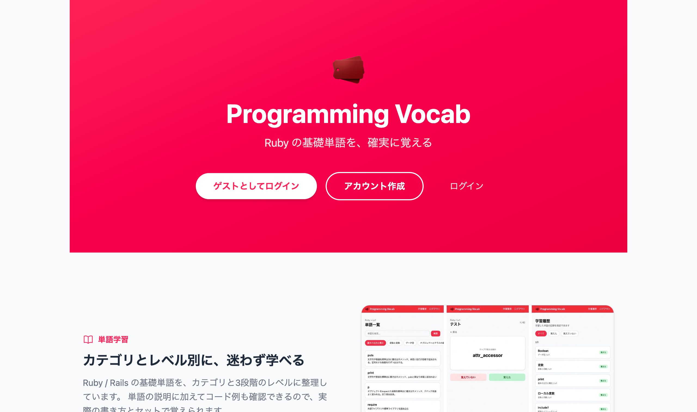
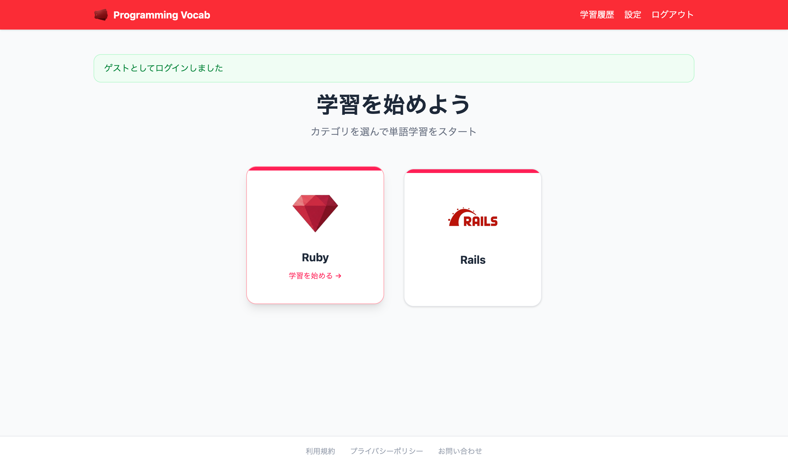
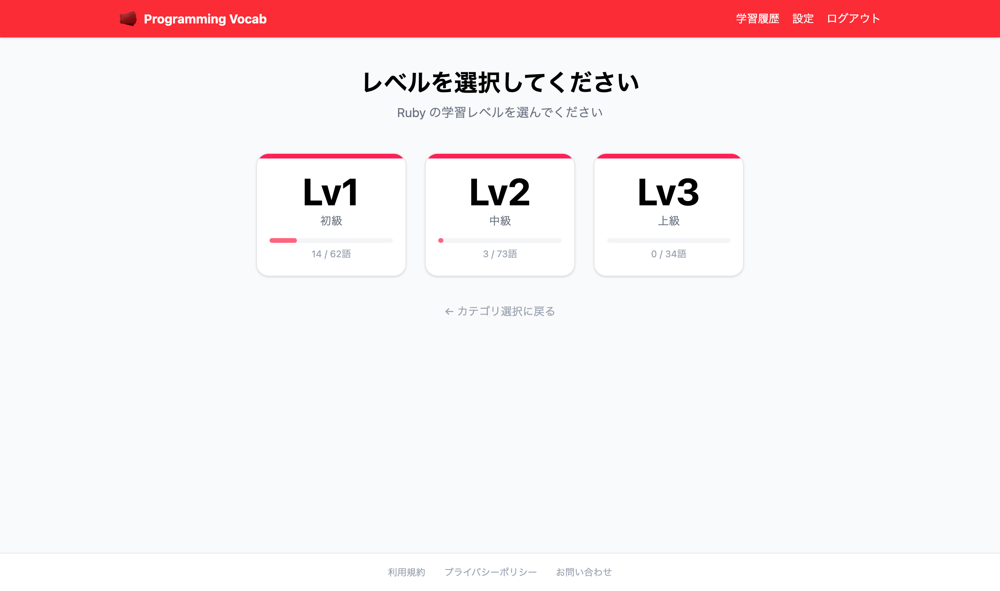
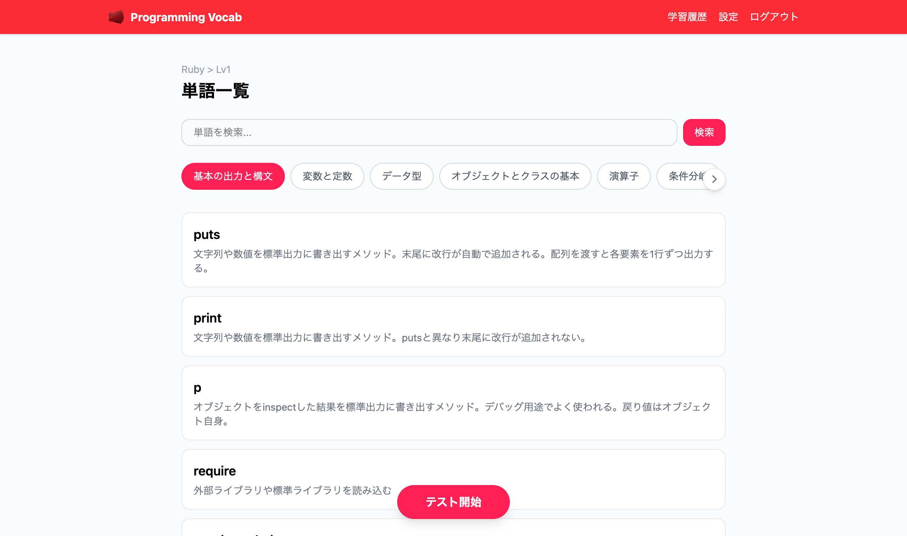
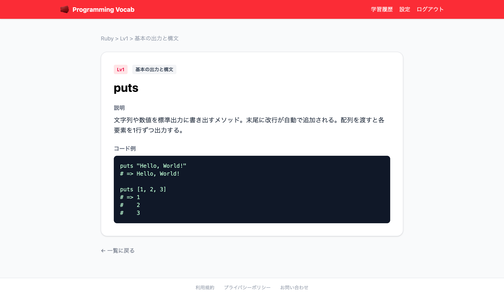
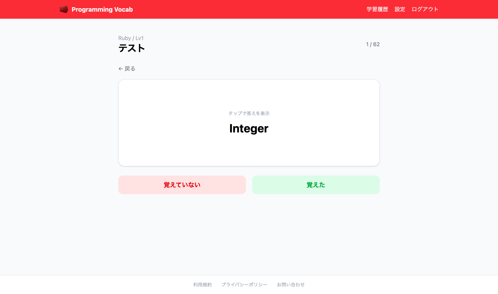
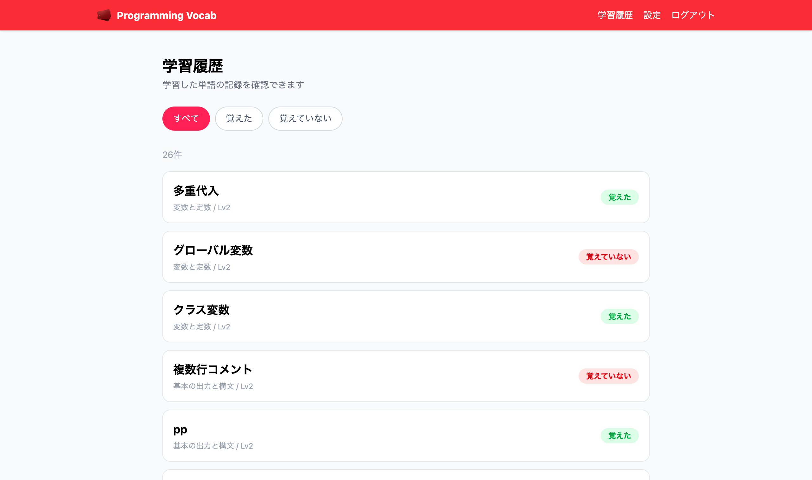
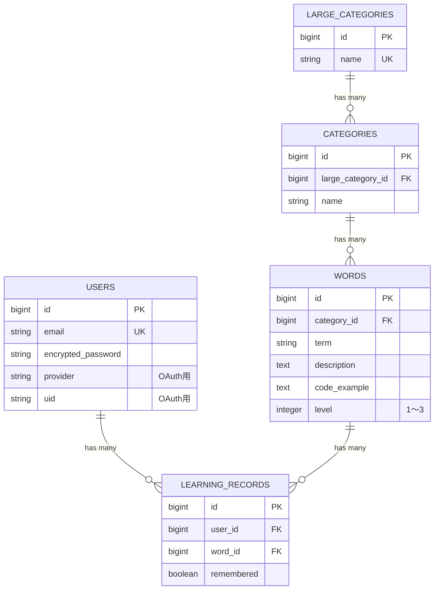

# Programming Vocab App 📕

Ruby / Rails 初学者向けの、プログラミング用語をカテゴリ・レベル別に整理して学べる単語帳アプリです。

[](https://github.com/egachan3/programming-vocab-app/actions/workflows/ci.yml)
[](.ruby-version)
[](Gemfile)

**🔗 デモ: https://programming-vocab-app.onrender.com**
トップページの「ゲストとしてログイン」から、会員登録なしですぐに全機能を試せます。



---

## 目次

- [概要](#概要)
- [主な機能](#主な機能)
- [画面イメージ](#画面イメージ)
- [技術スタック](#技術スタック)
- [ER図](#er図)
- [セットアップ](#セットアップ)
- [テストの実行](#テストの実行)
- [インフラ構成](#インフラ構成)
- [こだわったポイント](#こだわったポイント)
- [開発中に直面した問題と解決](#開発中に直面した問題と解決)
- [今後の展望](#今後の展望)
- [企画背景(なぜ作ったか)](#企画背景なぜ作ったか)

## 概要

RubyやRuby on Railsの学習を進める中で、用語や関数・クラスの意味を「理解したつもり」のまま進めてしまい、後から何度も教材やメモを見返す、という課題を解決するための学習用単語帳アプリです。

- 学習が必要な基礎用語をカテゴリ・レベル別に整理して提供
- 「覚えた/覚えていない」を記録しながら反復学習できる
- 学習履歴からいつでも進捗を振り返れる

企画の詳細な経緯(課題整理・想定ユーザー・競合調査など)は[企画背景](#企画背景なぜ作ったか)を参照してください。

## 主な機能

| 機能 | 概要 |
|---|---|
| 単語学習 | 大カテゴリ→カテゴリ→レベル別に整理された単語を学習 |
| テスト機能 | 単語帳形式で出題し、「覚えた/覚えていない」を記録 |
| 学習履歴 | 学習した単語の記録をいつでも確認、レベル別の進捗を可視化 |
| 検索 | 単語の検索(ransack) |
| 認証 | メール/パスワード認証(Devise) + Googleアカウントログイン(OmniAuth) |
| ゲストログイン | 会員登録なしで全機能を試せる |

## 画面イメージ

| カテゴリ選択 | レベル選択(学習進捗) |
|---|---|
|  |  |
| 学習したい大カテゴリを選ぶ | レベルごとに「覚えた単語数 / 全単語数」を表示 |

| 単語一覧 | 単語詳細 |
|---|---|
|  |  |
| カテゴリタブの切り替えと単語検索 | 説明に加えてコード例も確認できる |

| テスト機能 | 学習履歴 |
|---|---|
|  |  |
| カードをタップして答えを表示し、記録を保存 | 「覚えた / 覚えていない」で絞り込み可能 |

## 技術スタック

| 分類 | 技術 |
|---|---|
| 言語 / フレームワーク | Ruby 3.4.3 / Rails 8.1 |
| フロントエンド | Tailwind CSS(tailwindcss-rails)、Turbo、Stimulus、importmap-rails |
| データベース | PostgreSQL([Supabase](https://supabase.com)、無料プラン) |
| 認証 | [Devise](https://github.com/heartcombo/devise) + [omniauth-google-oauth2](https://github.com/zquestz/omniauth-google-oauth2) |
| ページネーション | [kaminari](https://github.com/kaminari/kaminari) |
| 検索 | [ransack](https://github.com/activerecord-hackery/ransack) |
| デプロイ | [Render](https://render.com)(無料プラン) |
| 休止対策 | [UptimeRobot](https://uptimerobot.com)(Render向け) + GitHub Actions(Supabase向け) |
| テスト | RSpec(単体・結合テスト) + Capybara / Selenium(system spec = E2E) |
| セキュリティ | [Brakeman](https://brakemanscanner.org/)、[bundler-audit](https://github.com/rubysec/bundler-audit)(CIで自動実行) |
| CI | GitHub Actions(lint / セキュリティスキャン / テスト / system test) |

## ER図



- `Word` はレベル(1〜3)を持ち、レベル別の学習・進捗管理を可能にしている
- `LearningRecord` はユーザーごとの「覚えた/覚えていない」を記録し、学習履歴・進捗表示に使われる
- `users(provider, uid)` にはユニークインデックスがあり、Googleアカウントとの1対1の紐付けを保証している

## セットアップ

```bash
git clone https://github.com/egachan3/programming-vocab-app.git
cd programming-vocab-app
bin/setup
```

`bin/setup` が依存gemのインストール・DBの準備・(必要なら)サーバー起動までを行います。個別に実行する場合は以下の通りです。

```bash
bundle install
bin/rails db:prepare
bin/rails server
```

Google OAuthを試す場合は `config/credentials.yml.enc` にGoogleのクライアントID/シークレットが必要です(`RAILS_MASTER_KEY` は各自の環境で管理してください)。設定なしでもメール/パスワード認証・ゲストログインは利用できます。

## テストの実行

```bash
bin/rails db:test:prepare && bundle exec rspec spec --exclude-pattern "spec/system/**/*"  # 単体・結合テスト(RSpec)
bin/rails db:test:prepare && bundle exec rspec spec/system                                # E2Eテスト(Capybara + Selenium)
bin/rubocop              # コードスタイルチェック
bin/brakeman              # セキュリティスキャン
bin/bundler-audit check   # 依存gemの脆弱性スキャン
```

これらはすべてGitHub ActionsのCIで、PRごとに自動実行されます。

## インフラ構成

```
GitHub (main) --push--> Render (Webアプリ、無料プラン)
                              |
                              v
                        Supabase (PostgreSQL、無料プラン)

UptimeRobot  --5分おきping--> Render   (15分無アクセスでスリープするため)
GitHub Actions --30分おきping--> Supabase (7日無アクセスで一時停止するため)
```

無料プランのみでポートフォリオとして常時アクセス可能な状態を維持する構成にしています。詳細な経緯は[docs/deployment.md](docs/deployment.md)を参照してください。

## こだわったポイント

- **Googleアカウントログインの実装**: Devise + OmniAuthでGoogleログインを実装。既にメール認証で登録済みのユーザーが同じメールアドレスのGoogleアカウントでログインした場合に、新規作成せず既存アカウントへ連携するロジックや、`provider`/`uid`へのユニークインデックスによる重複防止など、実運用を意識した設計にした
- **無料インフラでの常時稼働**: Renderの無料DBが期限切れで自動削除される問題に直面し、Supabaseへ移行。GitHub Actionsの高頻度cronが実行タイミングを保証しないという実測に基づき、UptimeRobotと役割分担する構成に落ち着いた
- **クエリ最適化**: 進捗表示のSQLクエリを6回→2回、単語詳細表示を3回→1回に削減(GROUP BYでの一括集計・eager loading)。よく使う検索条件に複合インデックスも追加
- **Stimulusによる細かいUI制御**: 単語一覧のカテゴリタブは、選択中カテゴリへの自動スクロール・スクロール端到達時の矢印非表示切り替えを自作のStimulusコントローラーで実装。テスト画面のカード表裏切り替え・完了後の自動遷移もStimulusで制御

## 開発中に直面した問題と解決

実際に起きたトラブルとその解決策です。問題解決の過程を示すため、あえて記録しています。

| 問題 | 原因 | 解決 |
|---|---|---|
| レベル選択画面の進捗表示で、1リクエストあたり最大6回のSQLクエリが発行されていた | レベル(1〜3)ごとに「全単語数」「学習済み数」を個別に集計しており、3レベル×2クエリ=6クエリになっていた | `GROUP BY`で全レベル分を一括集計するクエリに変更し、6回→2回に削減 |
| 単語一覧・学習記録の検索が、テーブルの全件スキャンで遅くなっていた | 頻繁に絞り込みに使うカラムの組み合わせにインデックスがなかった | `words(category_id, level)`、`learning_records(user_id, word_id)` に複合インデックスを追加 |
| 単語詳細画面の表示で3回のSQLクエリが発行されていた(N+1) | `category`・`large_category`を個別に取得していた | `includes`によるeager loadingで1回に削減 |
| 検索機能の実装時、Ransackがエラーを返すようになった | Ransack 4系ではセキュリティ強化のため、検索対象にできるカラム・アソシエーションをモデル側で明示的に許可する必要がある仕様に変更されていた | `Word`モデルに`ransackable_attributes`/`ransackable_associations`を定義し、検索可能な範囲を明示的に絞って対応 |
| Renderの無料DBが期限切れで接続不能になり、デプロイが失敗し続けた | Renderの無料PostgreSQLは、アクセスの有無に関わらず作成から一定日数で自動削除される仕様だった | Supabase(無料PostgreSQL)へDBを移行。UptimeRobot + GitHub Actionsで定期pingし、休止も防止 |
| GitHub Actionsの定期ping(`*/10`cron)が、1時間以上動かないことがあった | GitHub Actionsのscheduleイベントは高頻度なcronほど負荷分散のため大幅に遅延・間引きされる仕様だった | 15分以内の応答が必須なRenderへのpingはUptimeRobot(HTTP監視専用サービス)に、猶予の大きいSupabaseへのpingのみGitHub Actionsに残す構成に変更 |
| 「Googleでログイン」ボタンを押しても機能していなかった | `link_to method: :post, data: { turbo: false }` という実装だったが、rails-ujs未導入のためdata-method属性が機能せず、かつturbo無効化によりTurbo自身のPOST変換も効かなくなっていた。E2E(system test)を書いて初めて発覚 | JSに依存せず動作する`button_to`(実体は`<form>`タグ)に置き換えて修正 |

## 今後の展望

- [ ] 単語帳のユーザー独自作成機能
- [ ] 学習進捗に応じたレコメンド機能
- [ ] Dependabotで検出される依存gem更新への継続的な追従

## 企画背景(なぜ作ったか)

<details>
<summary>クリックして開く(課題整理・想定ユーザー・競合調査など)</summary>

### きっかけ

RubyやRuby on Railsの学習を進める中で、MVCやルーティングなどの用語に加え、関数やクラスの意味・役割も曖昧になり、何度も教材やメモを見返すことがありました。そのたびに学習の流れが止まり、「理解したつもりでも定着していない」と感じたことが、このアプリを考えたきっかけです。

### 解決したい課題

- 用語の意味が曖昧だと、教材の内容やエラー内容を正しく理解しづらい
- 理解が浅いまま学習を進めることになり、実装や復習の効率が下がる
- 「自分は理解できていない」という感覚が積み重なり、学習への自信や継続意欲が下がる

→ 本当に解決したい課題: プログラミング初学者が、基礎用語への理解不足によって学習効率や自信を失ってしまうこと。

### 想定ユーザー

- プログラミングスクール受講生、独学でWeb開発を学ぶ人、働きながら学習している初学者(20代〜30代)
- PCで学習しつつ、スキマ時間はスマホでも復習したい人

### 既存サービスとの違い

Anki等の汎用フラッシュカードアプリはあるが、自分でカードの内容を整理する手間がかかり、初学者は「何を覚えるべきか」で迷いやすい。Ruby/Rails学習に必要な単語があらかじめ整理された状態で提供することで、最初から迷わず学習を始められる点に価値がある。

</details>
